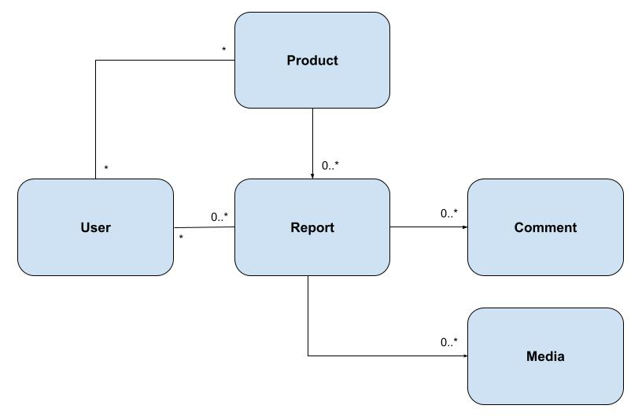

# Bug Tracker

*Last updated: 18/11/2023*

## Description

Bug tracker is a web application that allow users to report bugs encountered from various product applications. These reports are consolidated into a single view for developers to quickly review and prioritize bug fixes.

## Motivation

QA engineers and users are using messaging tools to report encountered bugs, ux issues and feature requests. These reports are consolidated manually in an infrequent basis into a word document which is tedious and time-consuming.

## Technologies used

TODO

## System Design

The following section discusses the initial system design for Bug Tracker.

### Use Cases & Assumptions

- The application is used in an offline environment
- Authentication/authorization services are handled externally
- A user can create reports of various types (eg. bug report, UX issue, feature request) for all products
- A user can attach media (videos/images) to a report
- A user (reporter/product developer) should be able to view all submitted reports for products that they own
- A reporter should be able to view their submitted reports

### Requirements

- The system should have high availability and low latency
- Images and videos attached to reports should be held in a persistent storage
- Fixed/Closed reports should be deleted after a set expiration date. Media attached to the report should be deleted as well
- There should be some gamification features to encourage users to submit reports

### Data Models

TODO: to update diagram to account for other entities

#### Account (~0.148KB)

|Key | Field | Type |  Max field Size | Explanation |Required |
|--- | ------| -----| -------- | -------------- | ----------- |
|PK| username | string | 64 | username ported from external system. Used as an id for the document | Yes |
|| display_name | string | 64 | display name rendered for the UI | Yes |
|| reward_points | int || points accumulated by the user from certain actions in the gamification feature. Defaults to `0` | Yes |
|| num_reports_created | int || number of reports submitted by the user. Defaults to `0` | Yes |
|| num_reports_fixed | int || number of bug/ux-issues fixed by the developer. Defaults to `0` | Yes |

#### Report (~1.152KB)

|Key | Field | Type |  Max field Size | Explanation |Required |
|--- | ------| -----| -------- | -------------- | ----------- |
| PK | id | string | 64 | id of document | Yes |
|FK| product_id | string | 64 | product key used for consolidation and filtering | Yes |
|| type | string | 16 | set of report type. Set to one of the following types: `bug`, `ux_issue`, `feature_request`, `others` | Yes
|| title | string | 64 | user input; title of the report | Yes |
|| description | string | 512 | user input description of the report. Supports rich text for indentations, bullet points etc | Yes |
|| external_link | string | 256 | optional URL string to link to external tools such as Jira/Gitlab etc | No |
|| status | string | 16 | set of report statuses. Set to one of the following statuses: `submitted`, `triaged`, `fixed`, `closed`, `fixing`. `fixed` status will act as `implemented` for feature requests| Yes |
|| created_date | string | 32 | report created datetime stored in ISO format | Yes |
|| fixed_date | string | 32 | datetime in ISO format; set when status is changed to `fixed`. Used for analytical purposes how see how long it takes to fix an issue| No |
|| expiration_date | string | 32 | datetime in ISO format; set when status is changed to `closed`. When a report is past this expiration date, this document (and other related documents) are deleted from the database | No |
|| reporter | string | 32 | username of the user that created the report | Yes |
|| assignee | string | 32 | username of the developer who is responsible for the report. Used for leaderboard purposes | No |

#### Comment (~0.448KB)

|Key | Field | Type |  Max field Size | Explanation |Required |
|--- | ------| -----| -------- | -------------- | ----------- |
|PK| id | string | 64 | id of the document | Yes |
|| author | string | 32 | username of the comment author | Yes |
|| created_date | string | 32 | datetime in ISO string, comment date | Yes |
|| text | string | 256 | comment | Yes |
|| is_edited | boolean || sets to `true` if the `text` field is edited. Defaults to `false` | Yes |
|FK| report_id | string | 64 | stores reference to the report | Yes |

#### Media (~0.384KB)

|Key | Field | Type |  Max field Size | Explanation |Required |
|--- | ------| -----| -------- | -------------- | ----------- |
|PK| id | string | 64 | id of the document | Yes |
|| file_name | string | 64 | name of the media file, user input | Yes
|| media_type | string | 16 | Type of the media, either `video` or `image` | Yes |
|| upload_date | string | 32 | datetime in ISO string, when the media is uploaded | Yes |
|| src_path | string | 128 | directory where this media is stored | Yes |
|| height | int || height of the media | Yes |
|| width | int || width of the media | Yes |
|FK| report_id | string | 64 | stores reference to the report | Yes |

#### Product (~0.384KB)

|Key | Field | Type |  Max field Size | Explanation |Required |
|--- | ------| -----| -------- | -------------- | ----------- |
|PK| id | string | 64 | id of the document | Yes|
|| name | string | 64 | product name | Yes|
|| description | string | 256 | description of product | No |

### Users & Traffic Estimates

- Assuming 10 monthly active users
- Assuming each user will submit an average of 1 report per month
- Assuming 25% of submitted reports to be accompanied by 1 video and 50% of submitted reports to be accompanied by ~3 images

### Storage Requirements

- Assuming each video is 1920x1080 and ~10seconds, it should be 1mb per submitted video. Each image should be 50KB
- Each month, (10 users x 1 report x (25% x 1MB)) + (10 users x 1 report x (50% x 0.05MB)) = 2.5MB + 0.25MB = **2.75MB of media storage per month**
- Assuming each report has 3 comments, each report will take up: 1.152KB + (3 x 0.448KB) = 2.496KB
- Each month, with an average of 10 reports with the accompanied media, (10  x 2.496KB) + (10 x 25% x 1 video x 0.384KB) + (10 x 50% x 3 images x 0.384KB) = **31.68KB of document storage per month**
- Total space needed per month: **2.781MB / month**
- Total space needed per year: 2.756MB x 12 = **~33.4MB / year**

## Modules

### 1. Gamification Service

Gamification feature is introduced to encourage users to report bugs, suggest product improvements and to enhance client-developer collaboration to build better products. The following table shows the proposed point system:

|Action | Points Rewarded | Affected users |
|--- | ------| -----|
| submitted a report | 1 | reporter |
| bug/ux issue report status changed to `fixed` | 3 | reporter, assignee |
| feature request status changed to `fixed` | 2 | reporter, assignee |

When the action on the table is performed, the backend serivce allocate points to the `Account` table under `reward_points`

#### Gamification service methods

- allocateRewardPoints(username: string, points: int) -> void
- getTopReporters(count: int) -> Account[]
- getTopBugFixers(count: int) -> Account[]
- addReporterReportCount(username: string, count: int) -> void
- addDeveloperBugFixCount(username: string, count: int) -> void

### 2. Report Clean-up Service

The report clean-up feature deletes documents and attached media objects past the report's expiration date. It will be a scheduled service that runs once a month.

#### Report clean-up service methods

- getExpiredReports() -> Report[]
- deleteReport(report_id: string) -> void

### 3. Report Service

Handles all report related endpoints.

#### Report service methods

- createReport(report: Report) -> Report
- updateReport(report: Report) -> void
- addComment(comment: Comment) -> Comment
- updateComment(comment: Comment) -> void

### 4. Media Service

The media service handles uploading and deletion of media related features. The proposed storage solution will be a static folder mounted on the server directory.

#### Media service methods

- uploadMedia(media: Media, dir_path: string) -> string (src_path)
- removeMedia(media_id: string) -> void

### 5. Product Service

The product service handles product related features. 

#### Product service methods

- createProduct(product: Product) -> Product
